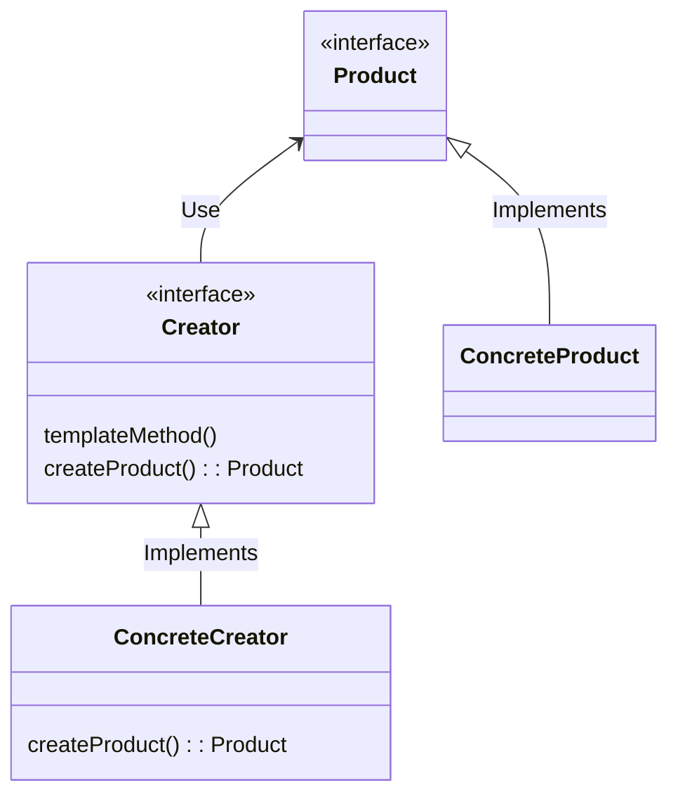

## 팩토리 메소드 패턴

***

### 구체적으로 어떤 인스턴스를 만들지는 서브 클래스가 정한다

- 다양한 구현체(Product)가 있고, 그 중에서 특정한 구현체를 만들 수 있는 다양한 팩토리(Creator) 를 제공할 수 있다.

 

- 생각해봐야할 점
  - 팩토리 메소드 패턴을 적용했을 때의 장점은? 단점은?
  - "확자에 열려있고 변경에 닫혀있는 객체 지향 원칙"을 설명하세요
  - 자바 8에 추가된 default 메소드에 대해 설명하세요

 

- 실무에서는 어떻게 쓰이나?
  - 단순한 팩토리 패턴
    - 매개변수의 값에 따라 또는 메소드에 따라 각기 다른 인스턴스를 리턴하는 단순한 버전의 팩토리 패턴
      - java.lang.Calendar 또는 java.lang.NumberFormat
  - 스프링 BeanFactory
    - Object 타입의 Product 를 만드는 BeanFactory 라는 Creator!
